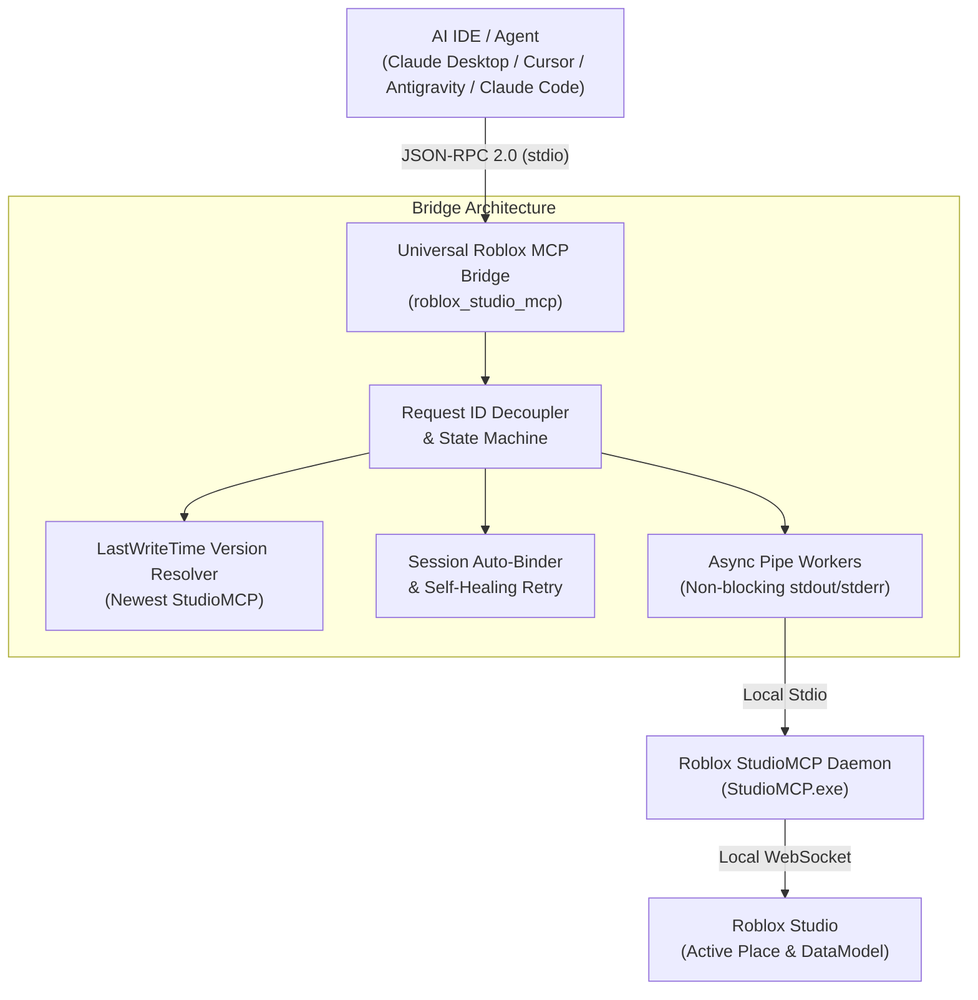

# Universal Roblox Studio MCP Bridge

[](LICENSE)
[](https://create.roblox.com/)
[](https://www.python.org/)
[](https://modelcontextprotocol.io/)

A universal, production-grade Model Context Protocol (MCP) bridge for **Roblox Studio**. Connects AI assistants (Claude Desktop, Cursor, Claude Code, Antigravity, OpenCode, Windsurf) directly to Roblox Studio with zero pipe deadlocks, automatic version discovery, self-healing session binding, and one-click IDE setup.

---

## ⚡ Why This Bridge?

Roblox Studio recently introduced a native Model Context Protocol server (`StudioMCP.exe`). However, connecting modern AI IDEs and agents to Roblox Studio on Windows and macOS encounters several critical bugs:

| Problem in Factory Setup | Impact | How Universal Bridge Solves It |
|---|---|---|
| **`server/discover` Handshake Panic** | IDE sends discovery probes; `StudioMCP.exe` strictly enforces `initialize` first and abruptly crashes with `EOF`. | Intercepts discovery probes and synthesizes compliant tool catalogs without crashing. |
| **OS Pipe Deadlock ("Working..." Freeze)** | `StudioMCP.exe` fills the OS `stderr` pipe buffer (~4KB on Windows), causing an infinite freeze. | Decoupled asynchronous non-blocking worker threads continuously drain `stderr` into an in-memory ring buffer. |
| **Roblox Auto-Updates Wipe Configs** | Roblox Studio updates weekly and overwrites `%LOCALAPPDATA%\Roblox\mcp.bat`. | Direct Python module invocation that is **100% immune to Roblox client updates**. |
| **Outdated Version Folder Selection** | Naive folder search picks stale `version-*` directories instead of the active one. | Dynamically queries all candidate versions and selects the **newest active build by timestamp**. |
| **Place & Session Disconnections** | Switching places or restarting Studio breaks the connection. | **Self-healing session manager** automatically queries `list_roblox_studios`, binds `set_active_studio`, and retries failed calls. |

---

## 🏗️ Architecture



---

## 🚀 Quick Install (One-Click)

### Windows (Command Prompt or PowerShell)
Clone or download this repository, then run:

```cmd
install.bat
```
*(Or in PowerShell: `powershell -ExecutionPolicy Bypass -File install.ps1`)*

This will:
1. Automatically detect and inject the `roblox_studio` MCP server into your Claude Desktop, Cursor, and OpenCode configuration files.
2. Run diagnostic health checks to verify that Roblox Studio and Python are ready.

---

## 🛠️ Manual Configuration

If you prefer to configure your MCP clients manually:

### 1. Claude Desktop (`claude_desktop_config.json`)
* **Windows:** `%APPDATA%\Claude\claude_desktop_config.json`
* **macOS:** `~/Library/Application Support/Claude/claude_desktop_config.json`

```json
{
  "mcpServers": {
    "roblox_studio": {
      "command": "python",
      "args": [
        "-m",
        "roblox_studio_mcp",
        "run"
      ],
      "env": {
        "PYTHONIOENCODING": "utf-8",
        "PYTHONUNBUFFERED": "1"
      }
    }
  }
}
```

### 2. Cursor (`~/.cursor/mcp.json`)
```json
{
  "mcpServers": {
    "roblox_studio": {
      "command": "python",
      "args": ["-m", "roblox_studio_mcp", "run"]
    }
  }
}
```

---

## 🩺 Diagnostics & CLI Commands

The built-in CLI provides diagnostics and management tools:

```bash
# 1. Check system status, candidate executables, and IDE config paths
python -m roblox_studio_mcp doctor

# 2. Inject configuration into specific IDE (or all)
python -m roblox_studio_mcp inject --target all

# 3. Eject / remove configuration cleanly
python -m roblox_studio_mcp eject --target all
```

---

## 🎮 Prerequisites in Roblox Studio

1. Open **Roblox Studio**.
2. Go to **File $\rightarrow$ Beta Features**.
3. Enable **Model Context Protocol**.
4. Restart Roblox Studio and open any Place/Project.

---

## 📜 License

MIT License. See [LICENSE](LICENSE) for details.
