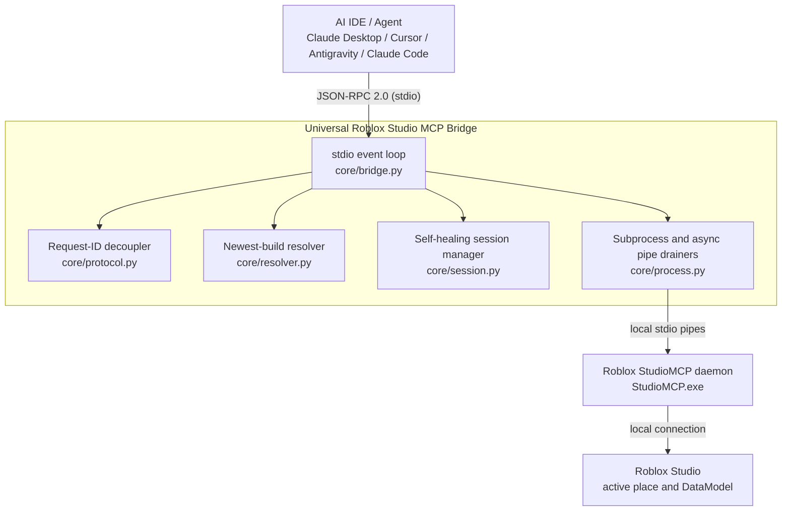

# Universal Roblox Studio MCP Bridge

[](https://github.com/Cpleasance/roblox-studio-mcp-bridge/actions/workflows/ci.yml)
[](LICENSE)
[](https://create.roblox.com/)
[](https://www.python.org/)
[](https://modelcontextprotocol.io/)

A pure-Python, standard-library-only [Model Context Protocol](https://modelcontextprotocol.io/) (MCP)
bridge for **Roblox Studio**. It sits between an AI IDE host (Claude Desktop, Cursor, Claude Code,
Antigravity, OpenCode, Windsurf) and Roblox Studio's native `StudioMCP` daemon, speaking JSON-RPC 2.0
over stdio on both sides. The bridge fixes the handshake, pipe-buffer, auto-update, version-selection,
and session-rebinding problems that make the stock setup unreliable.

- **No dependencies.** Runs on CPython 3.8+ with nothing but the standard library.
- **Update-proof.** Invoked as `python -m roblox_studio_mcp`, so weekly Roblox Studio updates cannot
  overwrite your configuration.
- **One command setup.** `python -m roblox_studio_mcp inject` writes the MCP server entry into every
  supported IDE config it can find.

---

## Project status

This is an **unofficial community tool**. It is not affiliated with, endorsed by, or supported by
Roblox Corporation. "Roblox" and "Roblox Studio" are trademarks of Roblox Corporation. Use it at your
own risk. The bridge only launches Roblox's own local `StudioMCP` executable and edits local IDE
configuration files; it opens no network listeners.

Current release: **v1.2.1**. See [CHANGELOG.md](CHANGELOG.md).

---

## Why this bridge?

Roblox Studio ships a native MCP server (`StudioMCP.exe` on Windows, `StudioMCP` on macOS). Pointing a
modern AI IDE at it directly runs into several bugs:

| Problem in the stock setup | Impact | How this bridge solves it |
|---|---|---|
| **`server/discover` handshake crash** | Some hosts send a `server/discover` probe before `initialize`; `StudioMCP` requires `initialize` first and drops the connection. | The bridge answers `server/discover` itself by proxying `tools/list`, so discovery never reaches the daemon out of order. |
| **stderr pipe deadlock ("Working…" freeze)** | `StudioMCP` writes enough to its `stderr` pipe to fill the OS buffer; with nobody draining it, the daemon blocks and the host hangs forever. | Dedicated daemon threads continuously drain both `stdout` and `stderr`; `stderr` lines land in a bounded in-memory ring buffer. |
| **Roblox auto-updates wipe configs** | Studio updates roughly weekly and rewrites its own launcher/config files. | The IDE config points at `python -m roblox_studio_mcp`, which the Roblox updater never touches. |
| **Stale `version-*` folder selection** | Naive lookups pick an old `version-<hash>` directory instead of the current build. | The resolver scans every known install root, prefers the folder that also contains the Studio Beta binary, and breaks ties by newest modification time. |
| **Place / session disconnects** | Switching places or restarting Studio breaks the tool connection; calls then fail silently. | The session manager auto-discovers Studio instances via `list_roblox_studios`, injects the resolved `studio_id` into every tool call, and transparently re-resolves and retries when it detects a disconnect or stale id. |
| **Requests that hang the host** | An internal failure used to leave the host waiting on a response id it would never receive. | Every failed request now returns a JSON-RPC `-32603` error so the host fails fast instead of hanging. |

---

## How it works



The package is small and each module has one job:

| Module | Responsibility |
|---|---|
| [`core/resolver.py`](roblox_studio_mcp/core/resolver.py) | Locates the `StudioMCP` executable. Honors `ROBLOX_STUDIO_MCP_PATH` / `STUDIO_MCP_PATH`, otherwise scans the Roblox install roots and returns the best candidate (Studio Beta companion present, then newest `mtime`). |
| [`core/process.py`](roblox_studio_mcp/core/process.py) | Spawns `StudioMCP` as a child process. One daemon thread reads `stdout` and resolves per-id response futures; another drains `stderr` into a `deque` ring buffer so the OS pipe never fills. A lock serializes all writes to the child's `stdin`. |
| [`core/protocol.py`](roblox_studio_mcp/core/protocol.py) | JSON-RPC 2.0 helpers, error-code constants, the negotiated MCP protocol version (`2024-11-05`), and `RequestIdDecoupler`, which hands out collision-free internal ids for requests the bridge originates. |
| [`core/session.py`](roblox_studio_mcp/core/session.py) | Resolves the target Studio instance with `list_roblox_studios`, caches its `studio_id`, and injects it into each forwarded tool call (unless the caller supplied one). On a detected disconnect or stale id it drops the cache and re-resolves, retrying up to 3 times with backoff. |
| [`core/bridge.py`](roblox_studio_mcp/core/bridge.py) | The stdio event loop. Reads host requests line by line, answers `initialize` / `ping` / `server/discover` / `resources/list` / `prompts/list` locally, forwards `tools/list` and `tools/call`, and guarantees a response (or `-32603`) for every request that has an id. Installs guarded signal handlers (`SIGINT`, `SIGTERM`, `SIGBREAK`). |
| [`core/_log.py`](roblox_studio_mcp/core/_log.py) | Shared logger. Everything diagnostic goes to **stderr**; `stdout` is reserved for the JSON-RPC stream. Level comes from `ROBLOX_STUDIO_MCP_LOG_LEVEL` (default `WARNING`). |
| [`injector/config_injector.py`](roblox_studio_mcp/injector/config_injector.py) | Detects installed IDEs and injects / ejects the `roblox_studio` MCP server entry, backing up any file it touches. |
| [`cli.py`](roblox_studio_mcp/cli.py) | Argument parsing for the `run` / `doctor` / `inject` / `eject` subcommands. |

---

## Requirements

- **OS:** Windows 10/11 or macOS. (The injector has a Linux fallback for Cursor/OpenCode/Antigravity,
  but the executable resolver only supports Windows and macOS install layouts.)
- **Python:** 3.8 or newer, on `PATH` as `python`.
- **Roblox Studio** with the **Model Context Protocol** beta feature enabled (see below).

### Enable MCP in Roblox Studio

1. Open **Roblox Studio**.
2. Go to **File → Beta Features**.
3. Enable **Model Context Protocol**.
4. Restart Studio and open any place.

---

## ⚡ 1-Click Quick Start (Click and Play)

1. **Enable MCP in Roblox Studio**:
   - Open Roblox Studio → **File** → **Beta Features** → check **Model Context Protocol** → Restart Studio and open any place.

2. **Run the 1-Click Installer**:
   - **Windows**: Double-click `install.bat` (or run `powershell -ExecutionPolicy Bypass -File install.ps1`)
   - **macOS**: Double-click `install.command` (or run `./install.sh` in Terminal)
   - **Manual / CLI**: `python -m roblox_studio_mcp inject`

3. **Restart your AI IDE** (Claude Desktop, Cursor, Antigravity, OpenCode).

That's it! The installer automatically detects Python, registers the package, writes the optimal MCP configuration to all your AI IDEs, and cleans up any conflicting scripts.

---

## Installation Details

The bridge is **run in place from the cloned repository** — there is no PyPI package and no build step.
The injector writes an IDE config entry that points `python -m roblox_studio_mcp` at wherever you
cloned the repo, so **the repo must stay where it is after you run `inject`**. If you move or delete
it, re-run `install.bat` or `python -m roblox_studio_mcp inject` from the new location.

### Config Entry Format

`inject` writes a `roblox_studio` entry like this into each config file it finds:

```json
{
  "mcpServers": {
    "roblox_studio": {
      "command": "C:\\Path\\To\\python.exe",
      "args": ["-m", "roblox_studio_mcp", "run"],
      "cwd": "C:\\Path\\To\\roblox-studio-mcp-bridge",
      "env": {
        "PYTHONIOENCODING": "utf-8",
        "PYTHONUNBUFFERED": "1",
        "PYTHONPATH": "C:\\Path\\To\\roblox-studio-mcp-bridge"
      }
    }
  }
}
```

- `command` is the detected Python interpreter (`sys.executable`).
- `cwd` and `PYTHONPATH` point at the repo root, so the package imports seamlessly.
- Existing servers in the file are preserved. The original file is copied to `*.backup.json` before
  every write; an unparseable file is copied to `*.corrupt.bak` and repaired.
- Any conflicting legacy Roblox `mcp.bat` entries are automatically purged.

### Auto-inject targets

`inject` / `eject` / `scrub` understand `--target all|claude|cursor|opencode|antigravity` (default `all`):

| Target | Config file(s) |
|---|---|
| `claude` | Windows: `%APPDATA%\Claude\claude_desktop_config.json`<br>macOS: `~/Library/Application Support/Claude/claude_desktop_config.json` |
| `cursor` | `~/.cursor/mcp.json` and `…/Cursor/User/globalStorage/roam.cursor-mcp/mcp.json` |
| `opencode` | `~/.opencode/mcp.json` |
| `antigravity` | `~/.gemini/antigravity/mcp_config.json` |

Hosts that are not auto-injected (e.g. **Claude Code**, **Windsurf**) still work — add an
`mcpServers.roblox_studio` entry manually using the JSON shown above.

---

## CLI commands

Run any of these from the repo root (or anywhere, if you installed via `pip install -e .`):

```bash
# Run the stdio bridge server (auto-scrubs bad mcp.bat entries on every startup)
python -m roblox_studio_mcp run

# Diagnostics: list StudioMCP candidates and verify all IDE configurations
python -m roblox_studio_mcp doctor

# 1-Click Inject: inject config into all detected AI IDEs (Claude Desktop, Cursor, Antigravity, OpenCode)
python -m roblox_studio_mcp inject --target all

# Scrub: remove any conflicting Roblox mcp.bat entries without touching other servers
python -m roblox_studio_mcp scrub --target all

# Eject: remove the roblox_studio entry from all IDEs
python -m roblox_studio_mcp eject --target all
```

`python -m roblox_studio_mcp` with no subcommand is equivalent to `run`.
`python -m roblox_studio_mcp --version` prints the version.

---

## Configuration / environment variables

| Variable | Purpose | Default |
|---|---|---|
| `ROBLOX_STUDIO_MCP_PATH` | Absolute path to a `StudioMCP` executable, or to a folder containing one. Skips auto-discovery entirely. | *(unset — auto-discover)* |
| `STUDIO_MCP_PATH` | Checked only if `ROBLOX_STUDIO_MCP_PATH` is unset. Same meaning. | *(unset)* |
| `ROBLOX_STUDIO_MCP_LOG_LEVEL` | Diagnostic log verbosity on **stderr**: `DEBUG`, `INFO`, `WARNING`, `ERROR`. | `WARNING` |
| `PYTHONPATH` | Set by the injector to the repo root so `python -m roblox_studio_mcp` resolves without an install. | *(set by `inject`)* |
| `PYTHONIOENCODING` / `PYTHONUNBUFFERED` | Set by the injector to `utf-8` / `1` for clean, unbuffered stdio. | *(set by `inject`)* |

---

## Troubleshooting

Start with the doctor — it does not modify anything:

```bash
python -m roblox_studio_mcp doctor
```

| Symptom | Likely cause / fix |
|---|---|
| `doctor` prints "No StudioMCP.exe found" | Roblox Studio is not installed, or the **Model Context Protocol** beta feature is off. Enable it, restart Studio, re-run `doctor`. As a last resort set `ROBLOX_STUDIO_MCP_PATH` to the executable. |
| Bridge exits immediately with a `[roblox-studio-mcp]` message on stderr | Same as above — `StudioMCP` could not be located. The message includes the remediation steps. |
| Tools appear in the IDE but every call returns "Roblox Studio is not connected" | Open a place in Studio and make sure the MCP beta feature is enabled. The session manager retries a few times, then returns this error. |
| IDE does not see the server at all | Confirm `inject` reported the right config file, then fully restart the IDE. Run `doctor` to see which config paths exist. |
| It broke after moving or deleting the repo folder | The config entry's `cwd` / `PYTHONPATH` still point at the old path. Re-run `python -m roblox_studio_mcp inject` from the new location. |
| Need more detail | Set `ROBLOX_STUDIO_MCP_LOG_LEVEL=DEBUG` (in the config entry's `env`, or your shell) and check the IDE's MCP log — all bridge logging goes to stderr. |
| Config used to get wiped by Roblox updates | Fixed in this bridge: the entry runs `python -m …`, which the updater never rewrites. Re-run `inject` once and you are done. |

---

## Development

```bash
git clone https://github.com/Cpleasance/roblox-studio-mcp-bridge
cd roblox-studio-mcp-bridge
pip install -e ".[dev]"

python -m pytest        # run the test suite (105 tests)
ruff check .            # lint
ruff format .           # format
```

The runtime code is **standard-library only** and must stay **Python 3.8 compatible**. See
[CONTRIBUTING.md](CONTRIBUTING.md) for coding conventions and the PR process.

---

## Contributing

Bug reports and pull requests are welcome. Please read [CONTRIBUTING.md](CONTRIBUTING.md) first.
For security issues, see [SECURITY.md](SECURITY.md).

---

## License

MIT License — see [LICENSE](LICENSE). Author: Cory Pleasance.
