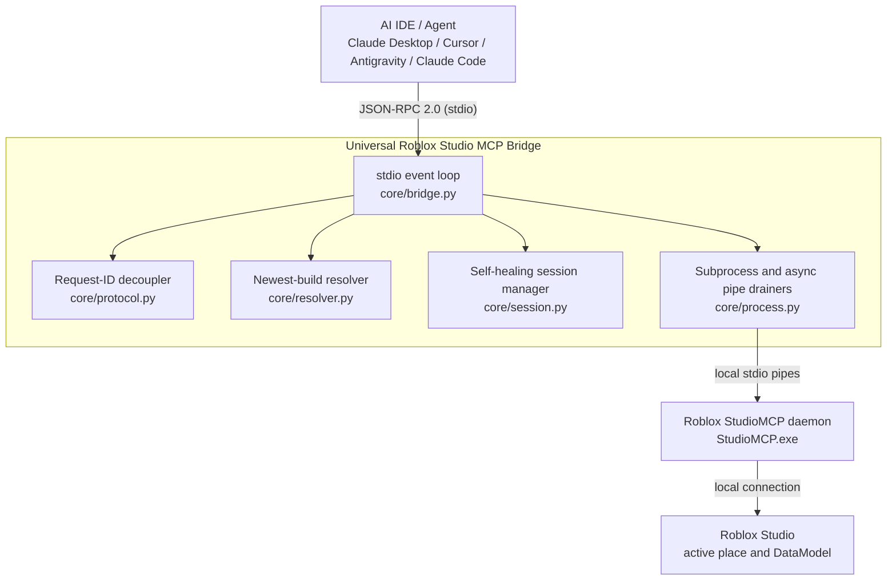

# Universal Roblox Studio MCP Bridge

[](https://github.com/Cpleasance/roblox-studio-mcp-bridge/actions/workflows/ci.yml)
[](LICENSE)
[](https://create.roblox.com/)
[](https://www.python.org/)
[](https://modelcontextprotocol.io/)

A pure-Python, standard-library-only [Model Context Protocol](https://modelcontextprotocol.io/) bridge
that connects an AI IDE (Claude Desktop, Cursor, Claude Code, Antigravity, OpenCode, Windsurf) to
Roblox Studio's native `StudioMCP` daemon. It fixes the handshake, pipe-buffer, auto-update,
version-selection, and session-rebinding bugs that make the stock setup unreliable.

*Unofficial community tool — not affiliated with or endorsed by Roblox Corporation. It only launches
Roblox's own local `StudioMCP` executable and edits local IDE config files; it opens no network
listeners. Current release: **v1.3.5** ([CHANGELOG.md](CHANGELOG.md)).*

---

## Quick start

**1. Enable MCP in Roblox Studio**
File → Beta Features → check **Model Context Protocol** → restart Studio and open any place.

**2. Install the bridge and write the IDE config**

| How | Command | Notes |
|---|---|---|
| **uvx** (recommended) | `uvx roblox-studio-mcp-bridge inject` | No install step. Needs [uv](https://docs.astral.sh/uv/). |
| **pip** | `pip install roblox-studio-mcp-bridge` then `roblox-studio-mcp inject` | Standard Python install. |
| **Double-click** | `install.bat` (Windows) / `install.command` (macOS) | Runs a source checkout in place — clone first. |

The installed command is `roblox-studio-mcp` (short alias) or `roblox-studio-mcp-bridge`. `inject`
detects how it was installed, writes the right MCP-server entry into every AI IDE it finds, removes
conflicting legacy entries, and prints a diagnostic report. Pick the entry style explicitly with
`inject --mode uvx|pip|repo` if the auto-detection guesses wrong.

**3. Restart your AI IDE** (Claude Desktop, Cursor, Antigravity, OpenCode).

That's it. To remove it later: `roblox-studio-mcp eject` (or `uninstall.bat` / `uninstall.command`).

> **Source-checkout (`--mode repo`) only:** the config points at the folder you cloned, so keep it
> where it is — if you move it, re-run `inject`. `uvx` and `pip` installs have no such dependency.

---

## What it fixes

Pointing a modern AI IDE directly at Roblox's `StudioMCP` runs into several bugs:

| Problem in the stock setup | Impact | How this bridge solves it |
|---|---|---|
| **`server/discover` handshake crash** | Some hosts send a `server/discover` probe before `initialize`; `StudioMCP` requires `initialize` first and drops the connection. | The bridge answers `server/discover` itself by proxying `tools/list`, so discovery never reaches the daemon out of order. |
| **Broken `mcp.bat` (`'else' is not recognized…`)** | Roblox's generated `%LOCALAPPDATA%\Roblox\mcp.bat` puts `)` and `else` on separate lines — invalid batch. It fails the moment the hard-coded `version-<hash>` path goes stale (i.e. after any Studio update). | `inject` / `scrub` / bridge startup rewrite `mcp.bat` with a correct, version-independent launcher (original kept as `mcp.bat.roblox-bak`), and strip Roblox's own `Roblox_Studio` entry. |
| **stderr pipe deadlock ("Working…" freeze)** | `StudioMCP` writes enough to its `stderr` pipe to fill the OS buffer; with nobody draining it, the daemon blocks and the host hangs forever. | Dedicated daemon threads continuously drain both `stdout` and `stderr`; `stderr` lines land in a bounded in-memory ring buffer. |
| **Roblox auto-updates wipe configs** | Studio updates roughly weekly and rewrites its own launcher/config files. | The IDE config points at `python -m roblox_studio_mcp`, which the Roblox updater never touches. The bridge also auto-scrubs re-injected `Roblox_Studio` entries and re-repairs `mcp.bat` on every startup. |
| **Stale `version-*` folder selection** | Naive lookups pick an old `version-<hash>` directory instead of the current build. | The resolver scans every known install root, prefers the folder that also contains the Studio Beta binary, and breaks ties by newest modification time. |
| **Place / session disconnects** | Switching places or restarting Studio breaks the tool connection; calls then fail silently. | The session manager auto-discovers Studio instances via `list_roblox_studios`, injects the resolved `studio_id` into every tool call, and transparently re-resolves and retries when it detects a disconnect or stale id. |
| **Requests that hang the host** | An internal failure used to leave the host waiting on a response id it would never receive. | Every failed request now returns a JSON-RPC `-32603` error so the host fails fast instead of hanging. |

---

## How this compares

| | Stock `StudioMCP` + `mcp.bat` | Minimal single-file fixes | **This bridge** |
|---|---|---|---|
| `server/discover` crash fixed | ❌ | ✅ | ✅ |
| stderr pipe-deadlock fixed | ❌ | ✅ | ✅ |
| Survives Roblox's weekly auto-update | ❌ (config overwritten) | ⚠️ re-run installer each update | ✅ auto-scrubs + re-repairs `mcp.bat` on every startup |
| Picks the newest Studio build | ❌ | ⚠️ first match | ✅ Beta-companion + newest mtime |
| Self-healing session rebind on disconnect | ❌ | ❌ | ✅ re-resolves + retries |
| Failed request can't hang the host | ❌ | ❌ | ✅ always returns `-32603` |
| Clients wired up by `inject` | — | 1 | Claude Desktop, Cursor, OpenCode, Antigravity (+ manual for Claude Code / Windsurf) |
| Install | copy files | copy files | `uvx` / `pip` / source |
| Tests / CI | — | — | 150+ tests, GitHub Actions |

---

## Requirements

- **OS:** Windows 10/11 or macOS. (The injector has a Linux fallback for Cursor/OpenCode/Antigravity,
  but the executable resolver only supports Windows and macOS install layouts.)
- **Python:** 3.8 or newer, on `PATH` as `python`.
- **Roblox Studio** with the **Model Context Protocol** beta feature enabled (see step 1 above).

---

## How it works



The package is small and each module has one job:

| Module | Responsibility |
|---|---|
| [`core/resolver.py`](roblox_studio_mcp/core/resolver.py) | Locates the `StudioMCP` executable. Honors `ROBLOX_STUDIO_MCP_PATH` / `STUDIO_MCP_PATH`, otherwise scans the Roblox install roots and returns the best candidate (Studio Beta companion present, then newest `mtime`). |
| [`core/process.py`](roblox_studio_mcp/core/process.py) | Spawns `StudioMCP` as a child process. One daemon thread reads `stdout` and resolves per-id response futures; another drains `stderr` into a `deque` ring buffer so the OS pipe never fills. A lock serializes all writes to the child's `stdin`. |
| [`core/protocol.py`](roblox_studio_mcp/core/protocol.py) | JSON-RPC 2.0 helpers, error-code constants, the negotiated MCP protocol version (`2024-11-05`), and `RequestIdDecoupler`, which hands out collision-free internal ids for requests the bridge originates. |
| [`core/session.py`](roblox_studio_mcp/core/session.py) | Resolves the target Studio instance with `list_roblox_studios`, caches its `studio_id`, and injects it into each forwarded tool call (unless the caller supplied one). On a detected disconnect or stale id it drops the cache and re-resolves, retrying up to 3 times with backoff. |
| [`core/bridge.py`](roblox_studio_mcp/core/bridge.py) | The stdio event loop. Reads host requests line by line, answers `initialize` / `ping` / `server/discover` / `resources/list` / `prompts/list` locally, forwards `tools/list` and `tools/call`, and guarantees a response (or `-32603`) for every request that has an id. Installs guarded signal handlers (`SIGINT`, `SIGTERM`, `SIGBREAK`). |
| [`core/_log.py`](roblox_studio_mcp/core/_log.py) | Shared logger. Everything diagnostic goes to **stderr**; `stdout` is reserved for the JSON-RPC stream. Level comes from `ROBLOX_STUDIO_MCP_LOG_LEVEL` (default `WARNING`). |
| [`injector/config_injector.py`](roblox_studio_mcp/injector/config_injector.py) | Detects installed IDEs and injects / ejects the `roblox_studio` MCP server entry, backing up any file it touches. |
| [`cli.py`](roblox_studio_mcp/cli.py) | Argument parsing for the `run` / `doctor` / `inject` / `scrub` / `eject` subcommands. |

---

## Installation details

The bridge ships on PyPI as
[`roblox-studio-mcp-bridge`](https://pypi.org/project/roblox-studio-mcp-bridge/). `inject` detects how
it is available and writes the matching config entry — force it with `--mode`:

| `--mode` | Config entry | Use when |
|---|---|---|
| `uvx` | `uvx roblox-studio-mcp-bridge run` | You have `uv`; nothing to install or keep. |
| `pip` | `<python> -m roblox_studio_mcp run` | Installed with `pip install roblox-studio-mcp-bridge`. |
| `repo` | same, plus `cwd` + `PYTHONPATH` to the checkout | Running a `git clone` in place (what `install.bat` does). |
| `auto` *(default)* | `repo` from a checkout, else `pip` | — |

### Config entry format

```jsonc
// uvx / pip mode — no path dependency
{ "mcpServers": { "roblox_studio": {
  "command": "uvx",                                // or the python interpreter, for pip mode
  "args": ["roblox-studio-mcp-bridge", "run"],      // or ["-m", "roblox_studio_mcp", "run"]
  "env": { "PYTHONIOENCODING": "utf-8", "PYTHONUNBUFFERED": "1" }
} } }

// repo mode — bound to the clone, which must not move
{ "mcpServers": { "roblox_studio": {
  "command": "C:\\Path\\To\\python.exe",
  "args": ["-m", "roblox_studio_mcp", "run"],
  "cwd": "C:\\Path\\To\\roblox-studio-mcp-bridge",
  "env": { "PYTHONIOENCODING": "utf-8", "PYTHONUNBUFFERED": "1",
           "PYTHONPATH": "C:\\Path\\To\\roblox-studio-mcp-bridge" }
} } }
```

- Existing servers in the file are preserved. The original file is copied to `*.backup.json` before
  every write; an unparseable file is copied to `*.corrupt.bak` and repaired.
- Roblox's own `Roblox_Studio` entry (its `mcp.bat` launcher, or the direct-`StudioMCP`
  form it writes on macOS) is automatically purged, and its broken `mcp.bat` is rewritten
  in place with a working launcher (original saved as `mcp.bat.roblox-bak`).

### Auto-inject targets

`inject` / `eject` / `scrub` understand `--target all|claude|cursor|opencode|antigravity` (default `all`):

| Target | Config file(s) |
|---|---|
| `claude` | Windows: `%APPDATA%\Claude\claude_desktop_config.json`<br>macOS: `~/Library/Application Support/Claude/claude_desktop_config.json` |
| `cursor` | `~/.cursor/mcp.json` and `…/Cursor/User/globalStorage/roam.cursor-mcp/mcp.json` |
| `opencode` | `~/.opencode/mcp.json` |
| `antigravity` | `~/.gemini/antigravity/mcp_config.json` |

Hosts that are not auto-injected (e.g. **Claude Code**, **Windsurf**) still work — add an
`mcpServers.roblox_studio` entry manually using the JSON shown above.

---

## CLI commands

With the package installed, use the `roblox-studio-mcp` command (or `python -m roblox_studio_mcp`, or
`uvx roblox-studio-mcp-bridge`) from anywhere:

```bash
# Run the stdio bridge server (auto-scrubs Roblox's entry + repairs mcp.bat on startup)
python -m roblox_studio_mcp run

# Diagnostics: list StudioMCP candidates and verify all IDE configurations
python -m roblox_studio_mcp doctor

# Inject config into all detected AI IDEs
python -m roblox_studio_mcp inject --target all

# Scrub: remove Roblox's own broken entry + repair its mcp.bat (leaves other servers alone)
python -m roblox_studio_mcp scrub --target all

# Eject: remove the roblox_studio entry from all IDEs
python -m roblox_studio_mcp eject --target all
```

`python -m roblox_studio_mcp` with no subcommand is equivalent to `run`.
`python -m roblox_studio_mcp --version` prints the version.

---

## Configuration / environment variables

| Variable | Purpose | Default |
|---|---|---|
| `ROBLOX_STUDIO_MCP_PATH` | Absolute path to a `StudioMCP` executable, or to a folder containing one. Skips auto-discovery entirely. | *(unset — auto-discover)* |
| `STUDIO_MCP_PATH` | Checked only if `ROBLOX_STUDIO_MCP_PATH` is unset. Same meaning. | *(unset)* |
| `ROBLOX_STUDIO_MCP_LOG_LEVEL` | Diagnostic log verbosity on **stderr**: `DEBUG`, `INFO`, `WARNING`, `ERROR`. | `WARNING` |
| `PYTHONPATH` | Set by the injector to the repo root so `python -m roblox_studio_mcp` resolves without an install. | *(set by `inject`)* |
| `PYTHONIOENCODING` / `PYTHONUNBUFFERED` | Set by the injector to `utf-8` / `1` for clean, unbuffered stdio. | *(set by `inject`)* |

---

## Troubleshooting

Start with the doctor — it does not modify anything:

```bash
python -m roblox_studio_mcp doctor
```

| Symptom | Likely cause / fix |
|---|---|
| `doctor` prints "No StudioMCP.exe found" | Roblox Studio is not installed, or the **Model Context Protocol** beta feature is off. Enable it, restart Studio, re-run `doctor`. As a last resort set `ROBLOX_STUDIO_MCP_PATH` to the executable. |
| IDE shows a red **MCP Error** on `Roblox_Studio` — `'else' is not recognized as an internal or external command` / `'"%B/..\StudioMCP.exe"'` / `expect initialized request` | That is Roblox's own broken `mcp.bat`, not this bridge. Run `roblox-studio-mcp inject` (or `scrub`) once and restart the IDE — the bridge removes the `Roblox_Studio` entry and rewrites `mcp.bat`. Its own `roblox_studio` entry is what you use. |
| Bridge exits immediately with a `[roblox-studio-mcp]` message on stderr | Same as above — `StudioMCP` could not be located. The message includes the remediation steps. |
| Tools appear in the IDE but every call returns "Roblox Studio is not connected" | Open a place in Studio and make sure the MCP beta feature is enabled. The session manager retries a few times, then returns this error. |
| IDE does not see the server at all | Confirm `inject` reported the right config file, then fully restart the IDE. Run `doctor` to see which config paths exist. |
| It broke after moving or deleting the repo folder | The config entry's `cwd` / `PYTHONPATH` still point at the old path. Re-run `python -m roblox_studio_mcp inject` from the new location. |
| Need more detail | Set `ROBLOX_STUDIO_MCP_LOG_LEVEL=DEBUG` (in the config entry's `env`, or your shell) and check the IDE's MCP log — all bridge logging goes to stderr. |
| Config used to get wiped by Roblox updates | Fixed in this bridge: the entry runs `python -m …`, which the updater never rewrites. Re-run `inject` once and you are done. |

---

## Development

```bash
git clone https://github.com/Cpleasance/roblox-studio-mcp-bridge
cd roblox-studio-mcp-bridge
pip install -e ".[dev]"

python -m pytest        # run the test suite
ruff check .            # lint
ruff format .           # format
```

The runtime code is **standard-library only** and must stay **Python 3.8 compatible**. See
[CONTRIBUTING.md](.github/CONTRIBUTING.md) for coding conventions and the PR process. For security
issues, see [SECURITY.md](.github/SECURITY.md).

---

## License

MIT License — see [LICENSE](LICENSE). Author: Cory Pleasance.
